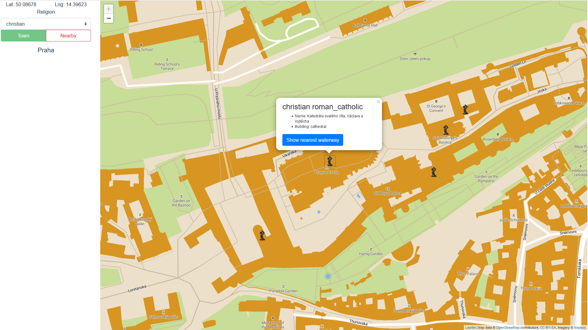
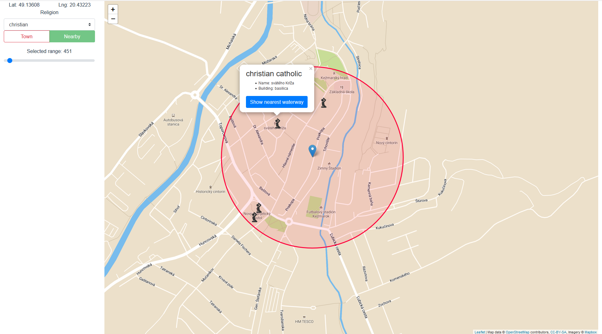
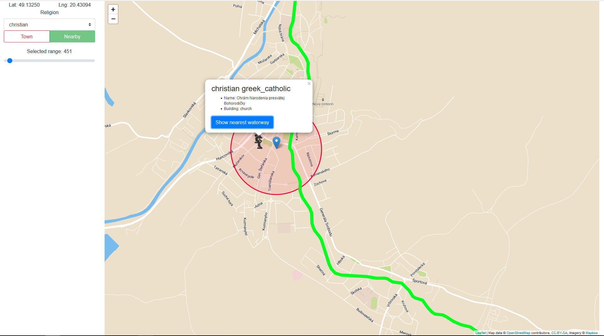

# Overview - Kamil Janeček
This application allow users to find a very good '[place_of_worship](https://wiki.openstreetmap.org/wiki/Tag:amenity%3Dplace_of_worship)'. User can choose to see all places in a town or in radius around point on map (e.g. i want to find nearest jewish synagogue from my position). And best feature is that you can find nearest waterway (max 15km) from selected place! After fetching all places you can filter them based on religion (if known).

For every displayed place of worship you can filter showed points by religion. After clicking on any point you'll see more information about the place (religion, denomination, building type - if this information is known).

Switching between action modes is accomplished using 2 buttons in the sidebar.
## UC 1
By clicking on any spot on map you will be showed border of town which contains the point and all places of worship in this town.


## UC 2
After choosing this use case you'll see an circle with all worship places which are in distance smaller than selected radius (from 50 to 10000 metres).


## UC 3
After selecting any place of worship, you can find nearest waterway.



# Frontend
Client application is implemented using [Vue](https://vuejs.org/) framework. Map is displayed thanks to javascript library [Leaflet](https://leafletjs.com/). Leaflet integration into Vue components was accomplished by using [Vue2Leaflet](https://github.com/KoRiGaN/Vue2Leaflet). Map tiles are fetched from mapbox with custom style (we changed buildings color to highlight them on the map). [Template](https://api.mapbox.com/styles/v1/kamko/cjox8h8161xh92snhft6q1at3.html?fresh=true&title=true&access_token=pk.eyJ1Ijoia2Fta28iLCJhIjoiY2pvd3RjcXNnMHN1NTNsbnl0eHg5dmlpZCJ9.nks03xACHawGHjfqtvkSTA#15.7/48.141591/17.107276/0) is publicly available.
# Backend
Application which communicates with database is written using [Express](https://expressjs.com/) web framework and [node-postgres](https://node-postgres.com/) for interaction with database.
## Data
Data was imported from OpenStreetMap using [osm2pgsl](https://github.com/openstreetmap/osm2pgsql) tool. It contains whole Slovakia and Czechia. Total size of the database is (6974 MB).

### Changes to data
To obtain a lot better performance we did some optimizations of the data.

1. **City polygons**

    As Slovakia and Czechia have different administration levels. Town in Slovakia is at level 8 but in Czechia it's at level 9. To simplify used queries we created materialized view containing all towns in these 2 countries.
    ```sql
    CREATE MATERIALIZED VIEW cz_sk_towns AS (
      WITH slovakia as (SELECT *
                        FROM planet_osm_polygon
                        WHERE admin_level = '2'
                          and name = 'Slovensko'),
        czechia as (SELECT *
                    FROM planet_osm_polygon
                    WHERE admin_level = '2'
                      and name = 'Česko')
        SELECT *
        FROM planet_osm_polygon
        WHERE (admin_level = '9' AND st_within(way, (SELECT way from slovakia)))
           OR (admin_level = '8' AND st_within(way, (SELECT way from czechia)))
    );
    ```
    And after that we created geo index on way in this new 'table':
    ```sql
    CREATE INDEX cz_sk_towns_geo_idx ON cz_sk_towns USING GIST (way);
    ```

2. **Polygon ids**

    We added UID column (serial id) for every polygon in database. Thanks to this we can get geo data of any town (if we know it's id) very fast and use that in other queries.
    ```sql
    ALTER TABLE planet_osm_polygon ADD COLUMN uid SERIAL;
    CREATE INDEX polygon_uid_idx ON planet_osm_polygon(uid);
    ```

3. **Places of worship as points**
    To simplify queries for places of worship we transformed all polygons (eg. church area) to points and merged (union) it with all chapels and other non-polygon places.
    ```sql
    CREATE OR REPLACE VIEW worship_places AS (
      SELECT osm_id,
             name,
             amenity,
             religion,
             denomination,
             building,
             historic,
             way
      FROM planet_osm_point
      WHERE amenity = 'place_of_worship'
      UNION ALL
      SELECT osm_id,
             name,
             amenity,
             religion,
             denomination,
             building,
             historic,
             st_centroid(way) as way
      FROM planet_osm_polygon
      WHERE amenity = 'place_of_worship');
      ```
     As this is just a view we've added indexes to original tables.
     ```sql
     CREATE INDEX point_amenity_idx ON planet_osm_point (amenity);
     CREATE INDEX polygon_amenity_idx ON planet_osm_polygon (amenity);
     CREATE INDEX planet_osm_polygon_centroid_idx ON planet_osm_polygon USING GIST (st_centroid(way));
     ```
4. **Waterway indexes**
    ```sql
    CREATE INDEX planet_osm_line_river_buffer_idx ON planet_osm_line USING GIST (st_buffer(way::geography, 150)) WHERE waterway IS NOT NULL;
    CREATE INDEX planet_osm_line_waterway_nn_idx ON planet_osm_line (waterway) WHERE waterway IS NOT NULL;
    ```

## Api
- **GET /worshipPlaces** (query_param = town_id), returns geojson containing all worship palces in selected town
    ```sql
    WITH town as (SELECT name, way
                  FROM planet_osm_polygon
                  WHERE uid = $1),
         data as (SELECT *
                  FROM worship_places
                  WHERE st_within(way, (SELECT way FROM town)))
    SELECT
      jsonb_build_object(
          'type', 'FeatureCollection',
          'features', jsonb_agg(features.jsonb_build_object)
        ) as geojson
    FROM (SELECT jsonb_build_object(
                     'type', 'Feature',
                     'geometry', st_asgeojson(st_centroid(way))::jsonb,
                     'properties',
                     (SELECT row_to_json(_) FROM (SELECT data.name, data.religion, data.building, data.denomination) as _)
                   )
          FROM data) features;
    ```
- **GET /town** (query_param = lat, lng), returns geojson containing information about town (including town uid)
    ```sql
    WITH data as (SELECT *
                  FROM cz_sk_towns
                  WHERE st_within(st_setsrid(st_makepoint($1, $2), 4326), way))
            SELECT jsonb_build_object(
                       'type', 'Feature',
                       'geometry', st_asgeojson(way)::jsonb,
                       'properties', (SELECT row_to_json(_) FROM (SELECT data.name) as _),
                       'id', uid
                     ) as geojson
            FROM data
    ```
- **GET /nearby** (query_param = lat, lng, range), returns geojson containing all worship places in range from selected point
    ```sql

    WITH data as (SELECT *
                  FROM worship_places
                  WHERE st_dwithin(way::geography, st_setsrid(st_makepoint($1, $2)::geography, 4326), $3))
    SELECT
      jsonb_build_object(
          'type', 'FeatureCollection',
          'features', jsonb_agg(features.jsonb_build_object)
        ) as geojson
    FROM (SELECT jsonb_build_object(
                     'type', 'Feature',
                     'geometry', st_asgeojson(st_centroid(way))::jsonb,
                     'properties',
                     (SELECT row_to_json(_) FROM (SELECT data.name, data.religion, data.building, data.denomination) as _)
                   )
          FROM data) features;
    ```
- **GET /waterways** - (query_param = lat, lng), returns geojson containing nearest waterway (max distance is 15km)
    ```sql
    WITH data as (WITH
      rivers as (SELECT name, way FROM planet_osm_line WHERE waterway IS NOT NULL),
      my_point as (SELECT st_setsrid(st_makepoint($1, $2), 4326) as point)
      SELECT r.name, r.way, st_distance(way::geography, point) dist
      FROM rivers r,
           my_point
      WHERE st_dwithin(way::geography, point, 15000)
      ORDER BY dist ASC
      LIMIT 1
    )
    SELECT
      jsonb_build_object(
          'type', 'FeatureCollection',
          'features', jsonb_agg(features.jsonb_build_object)
        ) as geojson
    FROM (SELECT jsonb_build_object(
                     'type', 'Feature',
                     'geometry', st_asgeojson(way)::jsonb,
                     'properties',
                     (SELECT row_to_json(_) FROM (SELECT data.name) as _)
                   )
          FROM data) features;
    ```
- **GET /religions** - returns list of all existing religions (in current dataset)


### Response
All responses with geodata are GeoJson FeatureCollections (except Town thats only one feature) objects created in database.

All queries use the common format
```sql
WITH data as (=== ARBITRATRY SQL CONTAINING DATA === )
SELECT
  jsonb_build_object(
      'type', 'FeatureCollection',
      'features', jsonb_agg(features.jsonb_build_object)
    ) as geojson
FROM (SELECT jsonb_build_object(
                 'type', 'Feature',
                 'geometry', st_asgeojson(way)::jsonb,
                 'properties',
                 (SELECT row_to_json(_) FROM (SELECT data.column_name) as _) -- you can add properties with correct names to final geojson
               )
      FROM data) features;
```
